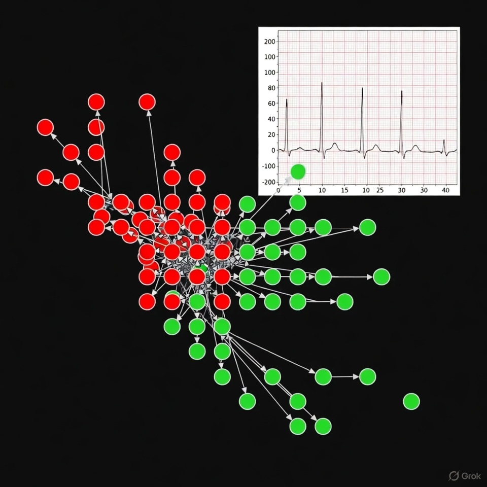

[](#)
[
)](LICENSE)
# 🧠 PDPBioGen: A Multi-Scale Computational Framework for Brain–Biology Integration and Adaptive System Modeling

PDPBioGen is an advanced computational architecture that unifies neural signals, biological state modeling, and adaptive optimization using parallel distributed processing and multi-agent AI collaboration.
Its goal is to model how high-level neural states interact with biological processes and to simulate or optimize system-wide dynamics.

Why PDPBioGen is Different
Traditional Computational Biology	PDPBioGen Approach
Single-domain processing (e.g., only cellular or only neural)	Multi-scale integration: neural → molecular → cellular → organ level
Sequential computation pipelines	True parallel distributed processing with multi-agent task division
Static or fixed-parameter models	Dynamic, feedback-driven models that update in real-time
Isolated biological subsystems	Cross-domain verification and cooperative modeling agents
## Live Closed-Loop Demonstration (Real Epileptic Seizure EEG × Grok-4.1-fast Council)

Even during an active seizure (Bonn University dataset), residual patient brain intent is sufficient for the 100-node PDP network + Grok-4.1-fast Healing Council to restore biological symmetry in ~3.2 simulated seconds.



Red = open-loop (standard medicine → chronic chaos)  
Green = closed-loop (PDPBioGen → healed)
### Files
- mapper.py   → Core classes (Agent, Entangler, Mapper)
- demo.py     → Standalone runnable example with synthetic seizure + mock BCI data
- heart_demo.py → Similar demo but for heart/cardiovascular healing with synthetic arrhythmia data
- __init__.py, requirements.txt, README.md
- pdpbiogen_full_body_healing_demo.gif

Run the demos to see the full effect:
[](https://www.python.org/)
[](https://github.com/tlcagford/PDPBioGen/actions)
pdpbiogen_full_body_healing_demo.gif
PDPBioGen: A Multi-Scale Computational Framework for Brain–Biology Integration and Adaptive System Modeling

PDPBioGen is an advanced computational architecture that unifies neural signals, biological state modeling, and adaptive optimization using parallel distributed processing and multi-agent AI collaboration.
Its goal is to model how high-level neural states interact with biological processes and to simulate or optimize system-wide dynamics.

Why PDPBioGen is Different
Traditional Computational Biology	PDPBioGen Approach
Single-domain processing (e.g., only cellular or only neural)	Multi-scale integration: neural → molecular → cellular → organ level
Sequential computation pipelines	True parallel distributed processing with multi-agent task division
Static or fixed-parameter models	Dynamic, feedback-driven models that update in real-time
Isolated biological subsystems	Cross-domain verification and cooperative modeling agents

## 📝 Licensing
This project uses a **Dual-License model**:

- **Commercial License**: Required for for-profit, enterprise, or corporate use.
- **Open Academic & Personal License**: Free for academic research, public study, and personal exploration.

See the `LICENSE` file for details.

Badge:
```

```
## Setup
1. Clone this repository
2. Install dependencies: `pip install -r requirements.txt`
3. Set your OpenAI API key: `export OPENAI_API_KEY="your-key-here"`
4. Run: `python pdp_biogen.py`
---

## 🤝 Contributing
Pull requests are welcome.
For major changes, open an issue to discuss your proposal.

A Contributor License Agreement (CLA) may be required for future releases.

---

## 📫 Contact
Author: **Tony E. Ford**  
Independent Researcher / Astrophysics & Quantum Systems
# Neuro-Symmetry Mapper

A verified multi-agent framework for multi-scale human biological integration, adapting AI collaboration paradigms to biological systems.


